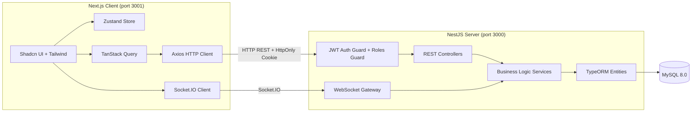

# ElectroPi — Task Management Application

> A production-minded full-stack task management board. Built with NestJS, Next.js, MySQL, and WebSockets.


---

## Table of Contents

- [Features](#-features)
- [Tech Stack](#-tech-stack)
- [Architecture](#-architecture)
- [Project Structure](#-project-structure)
- [Quick Start (Docker)](#-quick-start-docker)
- [Local Development](#-local-development)
- [Environment Variables](#-environment-variables)
- [API Reference](#-api-reference)
- [Testing](#-testing)
- [Seed Credentials](#-seed-credentials)
- [Design Decisions](#-design-decisions)

---

## ✨ Features

### Core
- 🔐 **JWT Authentication** — Tokens stored in `HttpOnly` cookies (XSS-safe). Secure password hashing with `bcrypt`.
- 👥 **Role-Based Access Control** — `Admin` and `Member` roles enforced at both API and service layers.
- 📁 **Projects** — Full CRUD. Admins/owners can add or remove project members. Members only see their own projects.
- ✅ **Tasks** — Full CRUD with `title`, `description`, `status`, `priority`, `due date`, `creator`, and `assignee` fields.
- 🔍 **Filtering & Pagination** — Filter tasks by `status`, `priority`, and `assignee`. Paginated responses.
- 🖥️ **Kanban Board** — Drag-and-drop task board powered by `@dnd-kit`.

### Bonus
- ⚡ **Real-time Updates** — WebSocket gateway (Socket.IO) broadcasts `task:created`, `task:updated`, and `task:deleted` events to all clients in a project room.
- 📜 **Audit Log** — Full history of task status changes stored in `task_history` table. Viewable in the Edit Task dialog.
- 📖 **Swagger / OpenAPI** — Auto-generated API docs at `/api/docs`.
- 🐳 **Docker Compose** — One-command setup for the entire stack.

---

## 🛠️ Tech Stack

| Layer | Technology |
|---|---|
| **Backend Framework** | NestJS 10 (TypeScript) |
| **Database** | MySQL 8.0 via TypeORM |
| **Auth** | JWT (HttpOnly Cookie) + Passport.js + bcrypt |
| **Real-time** | Socket.IO (WebSockets) |
| **API Docs** | Swagger / OpenAPI (`@nestjs/swagger`) |
| **Frontend Framework** | Next.js 15 (App Router) |
| **UI Components** | Shadcn UI + Tailwind CSS |
| **State Management** | Zustand |
| **Server State** | TanStack Query (React Query) |
| **Drag & Drop** | @dnd-kit |
| **HTTP Client** | Axios |
| **Testing** | Jest + NestJS Testing Module |
| **Containerization** | Docker + Docker Compose |

---

## 🏗️ Architecture



### Key Architectural Decisions

- **Monorepo** structure with `/client` and `/server` as independent apps, each with their own `package.json` and `Dockerfile`.
- **NestJS modules** are feature-scoped: `auth`, `users`, `projects`, `tasks`, and `common` (guards, filters, interceptors, decorators).
- **Global ValidationPipe** with `whitelist: true` strips unknown properties and prevents over-posting attacks.
- **Centralized error handling** via a global `AllExceptionsFilter` that returns consistent JSON error responses.
- **Response normalization** via a global `TransformInterceptor` for consistent API response shape.

---

## 📂 Project Structure

```
ElectroPi/
├── docker-compose.yml          # Full-stack Docker orchestration
├── client/                     # Next.js 15 frontend
│   ├── src/
│   │   ├── app/
│   │   │   ├── (auth)/         # Login & Register pages
│   │   │   └── (dashboard)/    # Project list & Kanban board pages
│   │   ├── components/
│   │   │   ├── kanban/         # KanbanBoard, TaskCard, Dialogs, Filters
│   │   │   ├── layout/         # AppShell, Sidebar, Header
│   │   │   └── ui/             # Shadcn UI primitives
│   │   ├── hooks/              # Custom React hooks
│   │   ├── lib/api/            # Axios API clients (auth, projects, tasks)
│   │   ├── store/              # Zustand auth store
│   │   └── types/              # Shared TypeScript types
│   └── Dockerfile
└── server/                     # NestJS backend
    ├── src/
    │   ├── auth/               # JWT strategy, login/register/logout
    │   ├── users/              # User entity & service
    │   ├── projects/           # Project CRUD + member management
    │   ├── tasks/              # Task CRUD + WebSocket gateway + audit log
    │   ├── common/
    │   │   ├── decorators/     # @CurrentUser()
    │   │   ├── filters/        # GlobalExceptionsFilter
    │   │   ├── guards/         # JwtAuthGuard, RolesGuard
    │   │   └── interceptors/   # TransformInterceptor
    │   ├── config/             # app.config.ts (ConfigModule)
    │   ├── database/
    │   │   ├── migrations/     # TypeORM migration files
    │   │   └── seed.ts         # Admin & Member seed script
    │   └── main.ts             # Bootstrap: Swagger, pipes, CORS, guards
    ├── .env.example
    └── Dockerfile
```

---

## 🐳 Quick Start (Docker)

> **Prerequisites**: Docker Desktop installed and running.

```bash
git clone <repository-url>
cd ElectroPi
docker-compose up --build
```

| Service | URL |
|---|---|
| Frontend (Client) | http://localhost:3001 |
| Backend API | http://localhost:3000/api |
| Swagger API Docs | http://localhost:3000/api/docs |

> The database schema is auto-synced on first run (`DB_SYNC=true` in the Docker Compose config).

---

## 💻 Local Development

> **Prerequisites**: Node.js v18+, a running MySQL 8.0 instance.

### 1. Clone the repository

```bash
git clone <repository-url>
cd ElectroPi
```

### 2. Setup the Backend

```bash
cd server

# Copy and configure environment variables
cp .env.example .env
# Edit .env with your local MySQL host, username, and password

npm install

# Run database migrations to create the schema
npm run migration:run

# Seed the database with Admin and Member test accounts
npm run seed

# Start in development mode (hot-reload)
npm run start:dev
```

The API will be available at `http://localhost:3000/api`.

### 3. Setup the Frontend

```bash
cd client

# Copy and configure environment variables
cp .env.local.example .env.local

npm install

# Start in development mode
npm run dev
```

The app will be available at `http://localhost:3001`.

---

## ⚙️ Environment Variables

### Backend — `server/.env`

| Variable | Description | Default |
|---|---|---|
| `PORT` | API server port | `3000` |
| `NODE_ENV` | Node environment | `development` |
| `DB_HOST` | MySQL host | `localhost` |
| `DB_PORT` | MySQL port | `3306` |
| `DB_USERNAME` | MySQL user | `root` |
| `DB_PASSWORD` | MySQL password | *(empty)* |
| `DB_NAME` | MySQL database name | `ElectroPiTask` |
| `DB_SYNC` | Auto-sync TypeORM schema (disable in prod) | `false` |
| `DB_LOGGING` | Log SQL queries to console | `true` |
| `JWT_SECRET` | Secret key for signing JWTs | `change_me` |
| `JWT_EXPIRES_IN` | JWT token expiry duration | `7d` |

### Frontend — `client/.env.local`

| Variable | Description | Default |
|---|---|---|
| `NEXT_PUBLIC_API_URL` | Base URL of the backend REST API | `http://localhost:3000/api` |

---

## 📡 API Reference

Full interactive documentation is available at **`http://localhost:3000/api/docs`** (Swagger UI).

### Authentication — `/api/auth`

| Method | Endpoint | Auth | Description |
|---|---|---|---|
| `POST` | `/api/auth/register` | ❌ | Register a new user |
| `POST` | `/api/auth/login` | ❌ | Login and receive JWT cookie |
| `POST` | `/api/auth/logout` | ❌ | Clear the JWT cookie |
| `GET` | `/api/auth/me` | ✅ | Get current user profile |

### Projects — `/api/projects`

| Method | Endpoint | Auth | Description |
|---|---|---|---|
| `POST` | `/api/projects` | ✅ | Create a new project |
| `GET` | `/api/projects` | ✅ | List all accessible projects |
| `GET` | `/api/projects/:id` | ✅ | Get a single project |
| `PATCH` | `/api/projects/:id` | ✅ Admin/Owner | Update a project |
| `DELETE` | `/api/projects/:id` | ✅ Admin/Owner | Delete a project |
| `POST` | `/api/projects/:id/members` | ✅ Admin/Owner | Add a member to a project |
| `DELETE` | `/api/projects/:id/members/:userId` | ✅ Admin/Owner | Remove a member from a project |

### Tasks — `/api/projects/:projectId/tasks`

| Method | Endpoint | Auth | Description |
|---|---|---|---|
| `POST` | `/api/projects/:pid/tasks` | ✅ Member | Create a task |
| `GET` | `/api/projects/:pid/tasks` | ✅ Member | List tasks (supports filtering & pagination) |
| `GET` | `/api/projects/:pid/tasks/:id` | ✅ Member | Get a single task |
| `GET` | `/api/projects/:pid/tasks/:id/history` | ✅ Member | Get audit log of status changes |
| `PATCH` | `/api/projects/:pid/tasks/:id` | ✅ Member | Update a task |
| `DELETE` | `/api/projects/:pid/tasks/:id` | ✅ Admin/Owner/Creator | Delete a task |

#### Task Filtering Query Parameters

```
GET /api/projects/:pid/tasks?status=in_progress&priority=high&assigneeId=2&page=1&limit=10
```

| Param | Type | Values |
|---|---|---|
| `status` | `string` | `todo` \| `in_progress` \| `done` |
| `priority` | `string` | `low` \| `medium` \| `high` |
| `assigneeId` | `number` | User ID |
| `page` | `number` | Default: `1` |
| `limit` | `number` | Default: `10` |

### WebSocket Events — Socket.IO

Connect to the backend URL. Emit `joinProject` with a `projectId` to subscribe to a project room.

| Event (emit) | Payload | Description |
|---|---|---|
| `joinProject` | `projectId: number` | Subscribe to real-time updates for a project |
| `leaveProject` | `projectId: number` | Unsubscribe from a project room |

| Event (listen) | Payload | Description |
|---|---|---|
| `task:created` | `Task` object | A new task was created in this project |
| `task:updated` | `Task` object | A task was updated in this project |
| `task:deleted` | `{ id, projectId }` | A task was deleted in this project |

---

## 🧪 Testing

Unit tests are written with Jest and the NestJS Testing Module.

```bash
cd server

# Run all unit tests
npm run test

# Run with coverage report
npm run test:cov

# Run end-to-end tests
npm run test:e2e
```

### Test Coverage

| File | Tests | What's Covered |
|---|---|---|
| `auth.service.spec.ts` | 4 | Register, Login (success, wrong password, user not found) |
| `projects.service.spec.ts` | 2 | Admin sees all projects, Member sees only their projects |
| `tasks.service.spec.ts` | 1 | Access control verification before returning tasks |
| `app.controller.spec.ts` | 1 | App health check |

---

## 🔑 Seed Credentials

After running `npm run seed` (or with Docker on first boot + `DB_SYNC=true`):

| Role | Email | Password |
|---|---|---|
| **Admin** | `admin@demo.com` | `Admin@123` |
| **Member** | `member@demo.com` | `Member@123` |

> The Admin account has full access to all projects and tasks. The Member account only sees projects they are added to.

---

## 🧠 Design Decisions

**Why HttpOnly Cookies instead of `localStorage` for JWT?**
Storing tokens in `localStorage` exposes them to XSS attacks. An `HttpOnly` cookie is inaccessible to JavaScript, making it a significantly safer transport mechanism. The `sameSite: 'strict'` and `secure` flags provide additional CSRF and transport protection.

**Why NestJS over Express?**
NestJS provides a highly structured, opinionated architecture (modules, decorators, DI) that maps naturally to the required separation of concerns and makes the codebase much easier to navigate and scale.

**Why TypeORM Migrations instead of `synchronize: true`?**
Schema synchronization is destructive in production (can drop columns). Migrations provide a version-controlled, safe, and reversible way to evolve the database schema.

**Why `@dnd-kit` for drag and drop?**
It is the most modern and accessible drag-and-drop library for React, with first-class support for keyboard navigation and a small bundle size compared to alternatives like `react-beautiful-dnd`.
