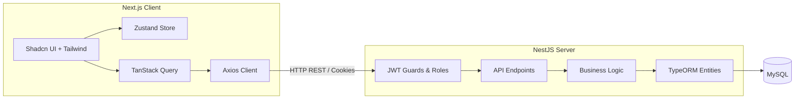

# ElectroPi Task Management Application

A full-stack, production-minded task management board built for the ElectroPi recruitment technical task. 

## 🏗️ Architecture Overview

This project is a monorepo containing two main parts:
1. **Frontend (`/client`)**: Built with **Next.js 15 (App Router)**, React, Tailwind CSS, Shadcn UI, Zustand, and TanStack Query.
2. **Backend (`/server`)**: Built with **NestJS**, TypeORM, and MySQL.



## ✨ Key Features
- **Secure Authentication**: JWT stored safely in HttpOnly cookies, guarding against XSS attacks. Includes bcrypt password hashing.
- **Role-Based Access Control**: Admins vs Members.
- **Projects & Kanban Board**: Create projects and manage tasks using a beautiful drag-and-drop Kanban board (powered by `@dnd-kit`).
- **Filtering**: Filter tasks by status, priority, and assignee.
- **Responsive Design**: Mobile-first design for the dashboard and task board.
- **Automated Tests**: Unit tests for backend logic (Jest).
- **Docker Compose**: Ready to run out of the box with Docker.
- **Real-time Updates (Bonus)**: WebSockets (socket.io) integrated so task changes immediately reflect across all clients.
- **Audit Log (Bonus)**: View a timeline of status changes for any task in the Edit Task dialog.
- **Swagger Documentation (Bonus)**: Fully documented OpenAPI spec available at `/api/docs`.

## 🚀 Setup Instructions

### Option 1: Docker Compose (Recommended)
You can spin up the entire application (Backend, Frontend, and MySQL Database) with a single command:
```bash
docker-compose up --build
```
- Client will be available at: `http://localhost:3001`
- Server API will be available at: `http://localhost:3000/api`
- Swagger Docs (API Documentation): `http://localhost:3000/api/docs`

### Option 2: Local Development
Ensure you have Node.js (v18+) and a local MySQL instance running.

#### 1. Setup Backend
```bash
cd server
cp .env.example .env
# Edit .env with your local MySQL credentials
npm install
npm run migration:run
npm run seed  # Generates test users
npm run start:dev
```

#### 2. Setup Frontend
```bash
cd client
cp .env.local.example .env.local
npm install
npm run dev
```

## ⚙️ Environment Variables

### Backend (`server/.env`)
| Variable | Description | Default |
|---|---|---|
| `PORT` | API Server port | `3000` |
| `DB_HOST` | MySQL database host | `localhost` (or `db` for Docker) |
| `DB_PORT` | MySQL database port | `3306` |
| `DB_USERNAME` | MySQL user | `root` |
| `DB_PASSWORD` | MySQL password | (empty) |
| `DB_NAME` | MySQL database name | `ElectroPiTask` |
| `DB_SYNC` | Auto-sync TypeORM schema | `false` |
| `JWT_SECRET` | Secret key for JWT hashing | `change_me` |
| `JWT_EXPIRES_IN` | JWT token expiry | `7d` |

### Frontend (`client/.env.local`)
| Variable | Description | Default |
|---|---|---|
| `NEXT_PUBLIC_API_URL` | Base URL for the backend API | `http://localhost:3000/api` |

## 🧪 Testing

To run the automated backend tests:
```bash
cd server
npm run test
```

## 🔑 Seed Credentials
If you ran `npm run seed`, you can use the following credentials to test the application:

- **Admin Account**: `admin@demo.com` / `Admin@123`
- **Member Account**: `member@demo.com` / `Member@123`
